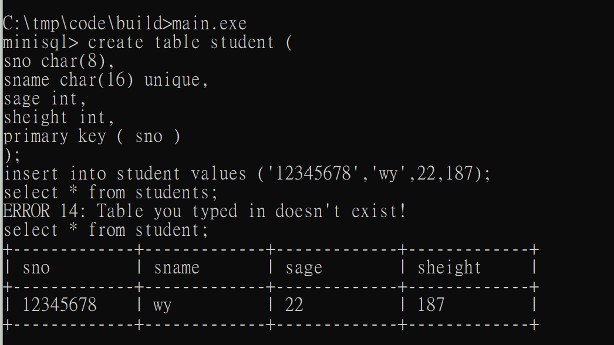

# minisql
This is the final project of Database system at Zhejiang University.

## Description
minisql is the simplified version of mysql. It contains the core function of mysql such as insert, select and delete.

It is built from scratch and without using any exist sql related libraries.

## Steps to Compile
```
cd \build
cmake .. -G "MinGW Makefiles"
cmake --build .
main.exe
```

## ScreenShots

